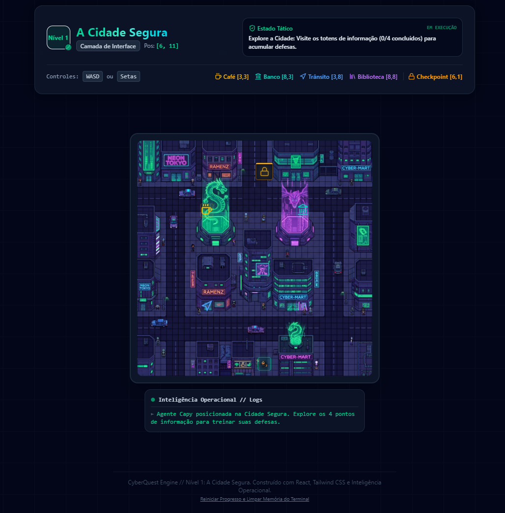
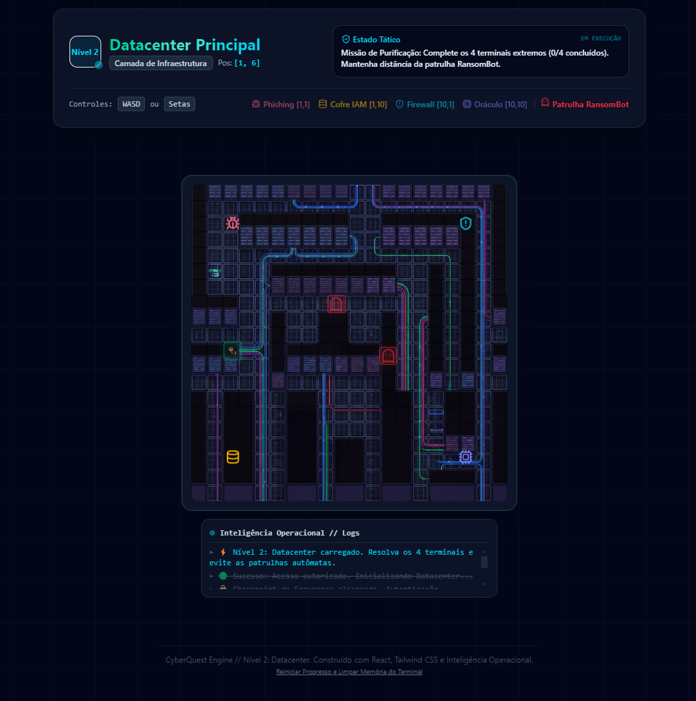

# 🕵️‍♀️ CyberQuest: Missão Datacenter


**CyberQuest** é um mini-RPG educacional desenvolvido em React. O objetivo do projeto é ensinar conceitos fundamentais de Cibersegurança de forma gamificada, unindo lógica de programação (Game Loop, State Management) com consciencialização em segurança da informação.

---

## 🎮 A Experiência do Jogo

O jogo é dividido em duas fases que testam tanto o conhecimento teórico quanto o pensamento estratégico do jogador:

### 1. O Hub (Cidade da Rede)
Um ambiente seguro de tutorial exploratório. O jogador navega livremente recolhendo dicas de segurança em totens interativos (Café, Banco, Semáforo e Biblioteca) para desbloquear o nível principal.



### 2. A Masmorra (Datacenter)
Um labirinto de sobrevivência baseado em turnos. O jogador precisa de se desviar de *Malwares* de patrulha para resolver 4 incidentes críticos de segurança.



### 🛡️ Módulos de Aprendizagem (Missões)
- **Engenharia Social (Phishing):** Análise de remetentes suspeitos e URLs maliciosas.
- **Gestão de Identidade (IAM):** Criação de senhas fortes e importância da Autenticação Multifator (MFA).
- **Segurança de Rede (Firewall):** Monitorização de tráfego e bloqueio de portas não autorizadas.
- **Segurança em IA:** Mitigação de ataques de *Prompt Injection* contra modelos de linguagem.

### 🤖 Inteligência Artificial Assimétrica
Para tornar o desafio dinâmico, os inimigos (RansomBots) possuem comportamentos distintos:
- **O Sentinela:** Patrulha corredores em velocidade acelerada.
- **O Caçador:** Utiliza *Pathfinding* para perseguir o jogador constantemente.
- **Mecânica de Extração (Modo Fúria):** Ao completar as missões, o sistema entra em colapso. A velocidade dos inimigos aumenta para uma perseguição 1:1 e um Portal de Fuga é ativado.

---

## 🛠️ Arquitetura e Tecnologias

- **Front-End:** React.js (Hooks, Event-Driven Architecture)
- **Estilização:** Tailwind CSS (Renderização condicional e animações)
- **Gráficos:** Sistema de *Overlay Invisível* (Matrizes de colisão invisíveis sobrepostas a artes top-down de alta resolução).
- **Ícones:** Lucide React

---

## 🔒 Postura de Segurança (AppSec)

Este projeto foi construído e auditado com foco em boas práticas de Segurança de Aplicações:
- **Secret Scanning:** Zero credenciais, tokens ou APIs hardcoded.
- **Higiene de Código:** Ausência de Information Disclosure (sem `console.log` a vazar o estado do jogo).
- **Prevenção de XSS:** Renderização segura de componentes React, sem uso de manipulação de DOM insegura (`dangerouslySetInnerHTML`).
- **Git Shield:** Ficheiro `.gitignore` blindado contra a fuga de chaves privadas e ficheiros de configuração de ambiente (`.env`).

---

## 🚀 Como correr o projeto localmente

1. Clone o repositório:
```bash
git clone [https://github.com/SEU_USUARIO/cyberquest.git](https://github.com/SEU_USUARIO/cyberquest.git)